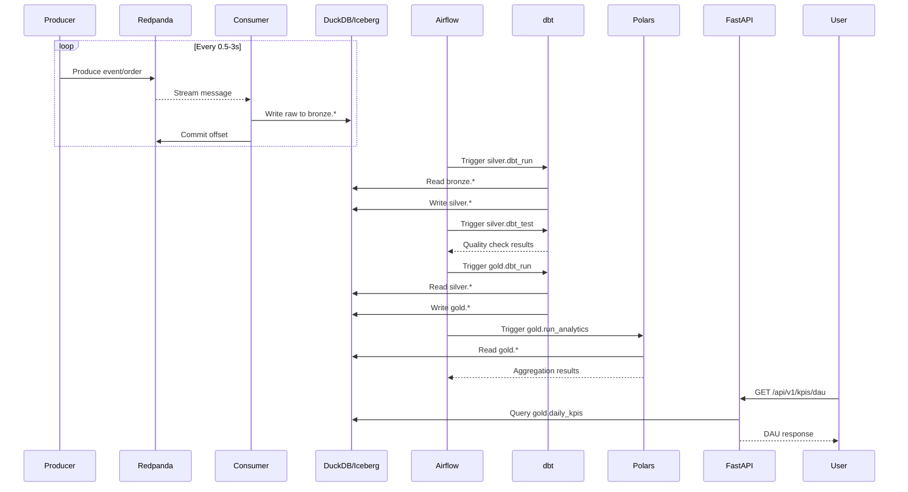

# Data Medallion

[](https://github.com/vanchasrujankumar/data-medallion-/actions/workflows/ci.yml)
[](https://codecov.io/gh/vanchasrujankumar/data-medallion-)
[](https://github.com/vanchasrujankumar/data-medallion-/blob/main/renovate.json)
[](https://snyk.io/test/github/vanchasrujankumar/data-medallion-)
[](https://python.org)
[](LICENSE)
[](.github/workflows/deploy.yml)

Production-grade real-time ELT pipeline using the **medallion architecture** (Bronze → Silver → Gold) with streaming ingestion via Redpanda, transformations via dbt + DuckDB/Iceberg, complex analytics via Polars, and orchestration via Airflow.

---

## Architecture

```mermaid
flowchart LR
    subgraph Sources["📡 Data Sources"]
        direction TB
        A1[Web Events]
        A2[Order System]
    end

    subgraph Streaming["⚡ Streaming Layer"]
        RP[Redpanda<br/>raw.events + raw.orders]
    end

    subgraph Bronze["🥉 Bronze Layer"]
        BC[Bronze Consumer<br/>Python + DuckDB Iceberg]
        BE[("bronze.events<br/>bronze.orders<br/>Raw, immutable")]
    end

    subgraph Silver["🥈 Silver Layer"]
        SV[dbt run<br/>bronze_to_silver]
        SQ[Data Quality<br/>dbt test]
        SE[("silver.events_clean<br/>silver.orders_validated<br/>Cleaned, typed")]
    end

    subgraph Gold["🥇 Gold Layer"]
        GR[dbt run<br/>silver_to_gold]
        PA[Polars Analytics<br/>RFM, Funnel, Anomaly]
        GE[("gold.daily_kpis<br/>gold.customer_360<br/>Business-ready")]
    end

    subgraph Serving["🚀 Serving Layer"]
        API[FastAPI<br/>REST API :8000]
    end

    subgraph Orchestration["🎼 Orchestration - Airflow"]
        AF[Airflow Scheduler<br/>medallion_pipeline DAG]
    end

    subgraph Storage["💾 Storage Layer"]
        MINIO[MinIO<br/>S3-compatible Object Store]
    end

    Sources -->|produce| RP
    RP -->|consume| BC
    BC -->|write Iceberg| BE
    BE -->|read| SV
    SV -->|quality checks| SQ
    SQ -->|pass| SE
    SE -->|read| GR
    GR --> GE
    GE -->|read| PA
    PA -->|serve| API
    AF -.->|orchestrates| BC
    AF -.->|triggers| SV
    AF -.->|triggers| GR
    AF -.->|triggers| PA
    BE -.-> MINIO
    SE -.-> MINIO
    GE -.-> MINIO

    style Bronze fill:#CD7F32,color:#fff
    style Silver fill:#C0C0C0,color:#000
    style Gold fill:#FFD700,color:#000
```



---

## Pipeline Flow



---

## Project Structure

```
data-medallion/
├── src/
│   ├── bronze/              # Raw ingestion layer
│   │   ├── config.py        # Pydantic settings (env-based)
│   │   ├── models.py        # Event, Order Pydantic models
│   │   ├── producer.py      # Real-time data simulator → Redpanda
│   │   └── consumer.py      # Redpanda → DuckDB Iceberg consumer
│   ├── silver/              # Transformation layer
│   │   ├── dbt_project.yml  # dbt project config
│   │   ├── profiles.yml     # DuckDB connection profile
│   │   └── models/
│   │       ├── sources.yml
│   │       ├── bronze_to_silver/   # Raw → Cleaned
│   │       │   ├── clean_events.sql
│   │       │   └── validate_orders.sql
│   │       └── silver_to_gold/     # Cleaned → Aggregated
│   │           ├── daily_kpis.sql
│   │           └── customer_360.sql
│   └── gold/                # Serving layer
│       ├── config.py        # Gold settings
│       ├── models.py        # API response models
│       ├── analytics.py     # Polars analytics engine
│       └── serve.py         # FastAPI REST server
├── airflow/
│   ├── dags/
│   │   └── medallion_pipeline.py   # Orchestration DAG
│   └── requirements-airflow.txt
├── tests/
│   ├── conftest.py          # Shared fixtures
│   ├── test_bronze_models.py
│   ├── test_bronze_producer.py
│   ├── test_silver_dbt.py
│   ├── test_gold_analytics.py
│   └── test_gold_api.py
├── .github/
│   ├── workflows/
│   │   ├── ci.yml           # Lint, test, docker build
│   │   ├── deploy.yml       # Manual deploy trigger
│   │   └── dbt-docs.yml     # dbt docs → GitHub Pages
│   ├── whitesource.yml      # Mend SCA/CVE automation
│   └── AGENTS.md            # AI agent guidelines
├── docker-compose.yml       # Local dev environment
├── Dockerfile               # App image
├── Dockerfile.test          # Test image
├── Makefile                 # Dev commands
├── renovate.json            # Auto-dependency updates
├── pyproject.toml           # Python project config
├── CLAUDE.md                # AI context for Claude Code
└── opencode.jsonc           # Local AI coding config
```

---

## Tech Stack

| Layer | Technology | Purpose |
|-------|-----------|---------|
| Streaming | [Redpanda](https://redpanda.com) | Kafka-compatible message broker |
| Storage | [MinIO](https://min.io) + [Apache Iceberg](https://iceberg.apache.org) | S3-compatible object store + table format |
| Compute | [DuckDB](https://duckdb.org) | Embedded OLAP with Iceberg support |
| Transform | [dbt-core](https://github.com/dbt-labs/dbt-core) | SQL transformations (duckdb adapter) |
| Analytics | [Polars](https://pola.rs) | Fast DataFrame analytics in Python |
| API | [FastAPI](https://fastapi.tiangolo.com) | REST API serving |
| Orchestration | [Airflow](https://airflow.apache.org) | Pipeline scheduling & monitoring |
| Container | [Docker Compose](https://docs.docker.com/compose) | Local development environment |
| CI/CD | [GitHub Actions](https://github.com/features/actions) | Automated testing & deployment |
| SCA | [Renovate](https://renovatebot.com) + [Mend](https://mend.io) | Dependency updates & CVE scanning |

---

## Quick Start

### Prerequisites

- [Docker Desktop](https://www.docker.com/products/docker-desktop/) (or Docker + Compose)
- [Python 3.12](https://python.org) (for local development)
- [uv](https://docs.astral.sh/uv/) (fast Python package manager)

### 1. Clone & Configure

```bash
git clone git@github.com:vanchasrujankumar/data-medallion-.git
cd data-medallion-
cp .env.example .env
# Edit .env if needed (defaults work for local dev)
```

### 2. Start Infrastructure

```bash
make up
```

This starts:
- **Redpanda** on `localhost:9092`
- **MinIO** on `localhost:9000` (console: `localhost:9001`)
- **Airflow** on `localhost:8080` (admin/admin)

### 3. Install Python Dependencies

```bash
uv sync
```

### 4. Run Tests

```bash
make test      # Unit tests
make lint      # Ruff + mypy
```

### 5. Start Producing Data

```bash
make produce   # Runs bronze producer — Ctrl+C to stop
```

### 6. Run dbt Transformations

```bash
cd src/silver
dbt run --profiles-dir . --project-dir .
```

### 7. Start the API

```bash
uv run uvicorn src.gold.serve:app --reload
# API at http://localhost:8000
# Docs at http://localhost:8000/docs
```

### 8. Trigger Airflow Pipeline

Open `http://localhost:8080` → Login `admin`/`admin` → Trigger `medallion_pipeline` DAG.

---

## Makefile Commands

| Command | Description |
|---------|-------------|
| `make up` | Start all Docker services |
| `make down` | Stop all services |
| `make logs` | Follow container logs |
| `make build` | Rebuild Docker images |
| `make test` | Run unit tests |
| `make test-docker` | Run tests in Docker |
| `make test-integration` | Run integration tests (`--run-integration`) |
| `make lint` | Run ruff + mypy |
| `make produce` | Start data producer |
| `make shell` | Open shell in app container |
| `make clean` | Remove local data & caches |

---

## API Endpoints

| Method | Path | Description |
|--------|------|-------------|
| GET | `/health` | Health check |
| GET | `/api/v1/kpis/dau` | Daily active users |
| GET | `/api/v1/products/top` | Top products by revenue |
| GET | `/api/v1/users/segments` | RFM user segmentation |
| GET | `/api/v1/funnel/conversion` | Conversion funnel analysis |
| GET | `/api/v1/anomalies` | Z-score anomaly detection |

Full API docs at `http://localhost:8000/docs` (Swagger UI).

---

## Security & Compliance

### Dependency Management

- **Renovate** — Automated dependency updates with auto-merge for minor/patch and security fixes ([config](renovate.json))
- **Mend (Whitesource)** — SCA scanning for CVEs in Python, Docker, and infrastructure dependencies ([config](.github/whitesource.yml))
- **Snyk** — Continuous vulnerability monitoring ([badge](#))

### Secrets & Credentials

- All secrets loaded via environment variables (`.env` — gitignored)
- MinIO credentials default to `minioadmin`/`minioadmin` (change in production)
- Airflow uses Fernet key from environment

### Container Security

- Python 3.12-slim base image (minimal attack surface)
- Docker health checks for all services
- No root containers (use `USER` directive in Dockerfile)

---

## Deployment

### Manual (via GitHub Actions)

```bash
# Trigger deploy workflow from GitHub UI:
# Actions → Deploy → "Run workflow" → select environment + tag
```

### Manual SSH

```bash
scp docker-compose.yml user@host:/opt/medallion/
scp .env.production user@host:/opt/medallion/.env
ssh user@host
cd /opt/medallion
docker compose pull
docker compose up -d
```

---

## Development

### Code Quality

- **Ruff** — Linting + formatting (line-length 100)
- **Mypy** — Strict type checking
- **Pre-commit** — Automated checks before commits

```bash
# Install pre-commit hooks
pre-commit install

# Run all checks
make lint
```

### Testing Strategy

| Layer | Test File | Type |
|-------|-----------|------|
| Bronze models | `test_bronze_models.py` | Unit |
| Bronze producer | `test_bronze_producer.py` | Unit |
| Silver dbt | `test_silver_dbt.py` | Compilation |
| Gold analytics | `test_gold_analytics.py` | Unit |
| Gold API | `test_gold_api.py` | Integration |
| Full pipeline | `conftest_integration.py` | E2E (--run-integration) |

---

## License

MIT — see [LICENSE](LICENSE)

---

## Contributing

1. Read [.github/AGENTS.md](.github/AGENTS.md) for AI agent guidelines
2. Fork the repo
3. Create a feature branch
4. Submit a PR — CI will run lint + test + docker build

---

_Maintained by [Srujan Kumar](https://github.com/vanchasrujankumar)_
